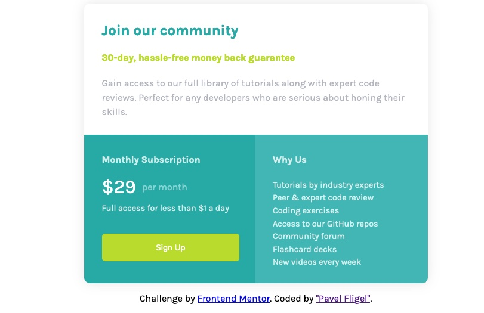

# Frontend Mentor - Single price grid component solution

This is a solution to the [Single price grid component challenge on Frontend Mentor](https://www.frontendmentor.io/challenges/single-price-grid-component-5ce41129d0ff452fec5abbbc). Frontend Mentor challenges help you improve your coding skills by building realistic projects. 

## Table of contents

- [Frontend Mentor - Single price grid component solution](#frontend-mentor---single-price-grid-component-solution)
  - [Table of contents](#table-of-contents)
  - [Overview](#overview)
    - [The challenge](#the-challenge)
    - [Screenshot](#screenshot)
    - [Links](#links)
  - [My process](#my-process)
    - [Built with](#built-with)
    - [What I learned](#what-i-learned)
  - [Author](#author)
  - [Acknowledgments](#acknowledgments)

## Overview

### The challenge

Users should be able to:

- View the optimal layout for the component depending on their device's screen size
- See a hover state on desktop for the Sign Up call-to-action

### Screenshot

### Links

- Solution URL: [Add solution URL here](https://your-solution-url.com)
- Live Site URL: [Add live site URL here](https://your-live-site-url.com)

## My process

### Built with

- Semantic HTML5 markup
- Flexbox
- Mobile-first workflow

### What I learned

- HTML
- CSS
- Flexbox
- Javascript
- Responsive web design

## Author

- Website - [Pavel Fligel](https://www.your-site.com)
- Frontend Mentor - [Zach Gollwitzer](https://www.zachgollwitzer.com/))

## Acknowledgments

 Many thanks to [Zach Gollwitzer](https://www.zachgollwitzer.com/) for his comprehensive online course on ["Frontend Web Development Bootcamp Course (JavaScript, HTML, CSS)"](https://youtu.be/zJSY8tbf_ys?feature=shared) on YouTube. His clear explanations and practical examples have greatly enhanced my understanding of frontend web development. The hands-on projects and coding challenges were particularly helpful in applying the learned concepts. I highly recommend this course to anyone interested in learning frontend web development.

